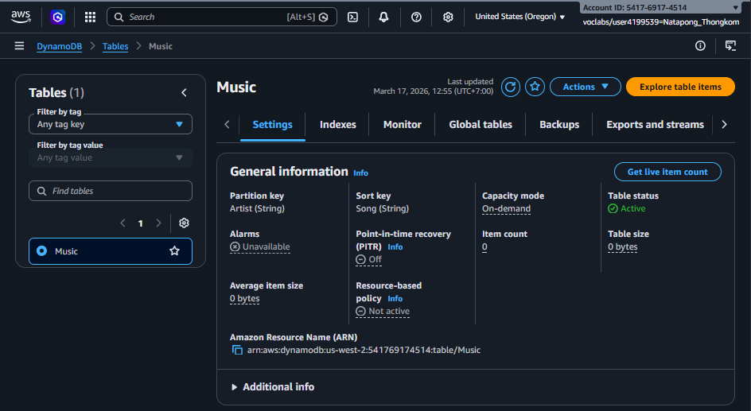
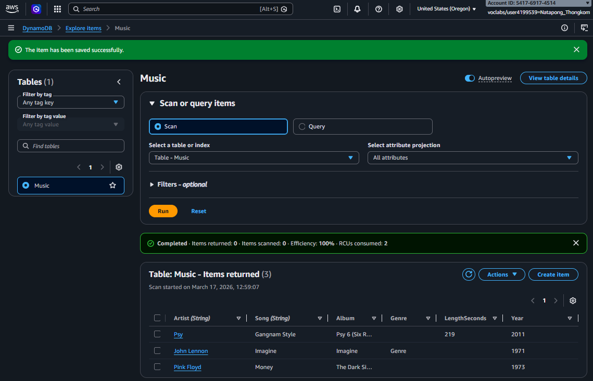
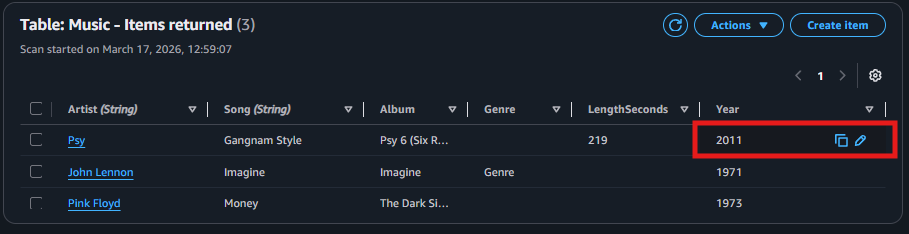
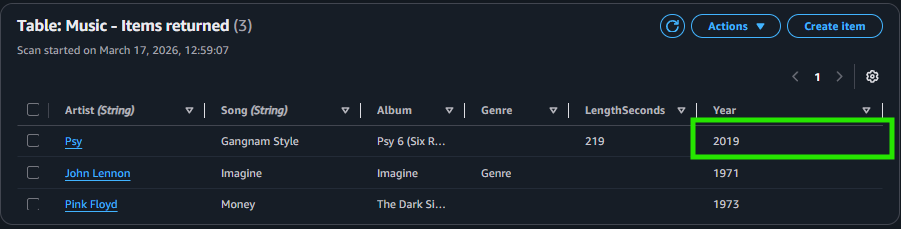
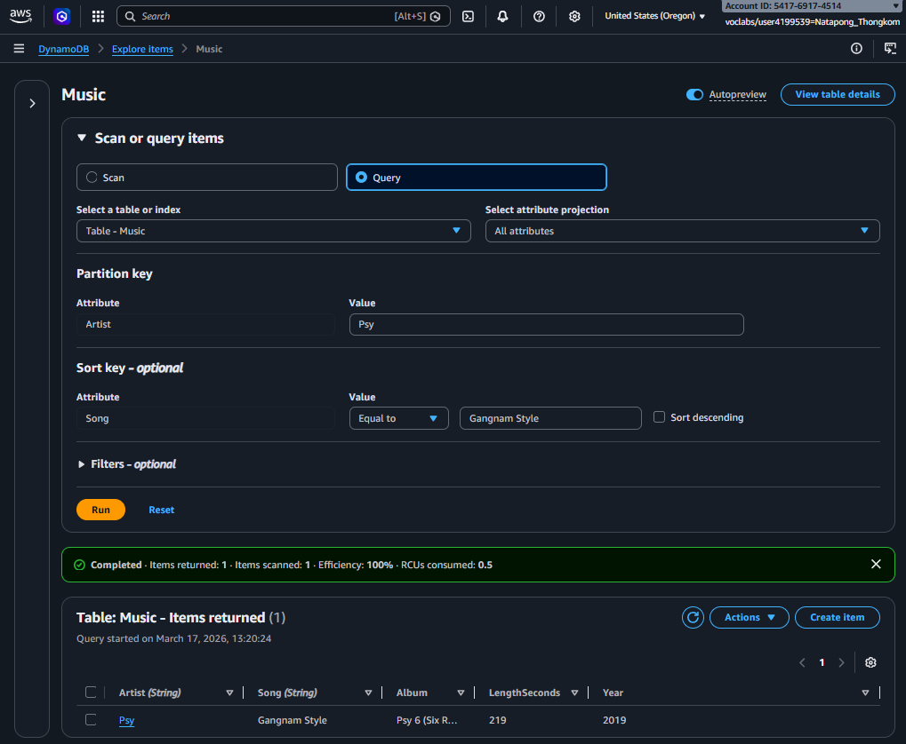
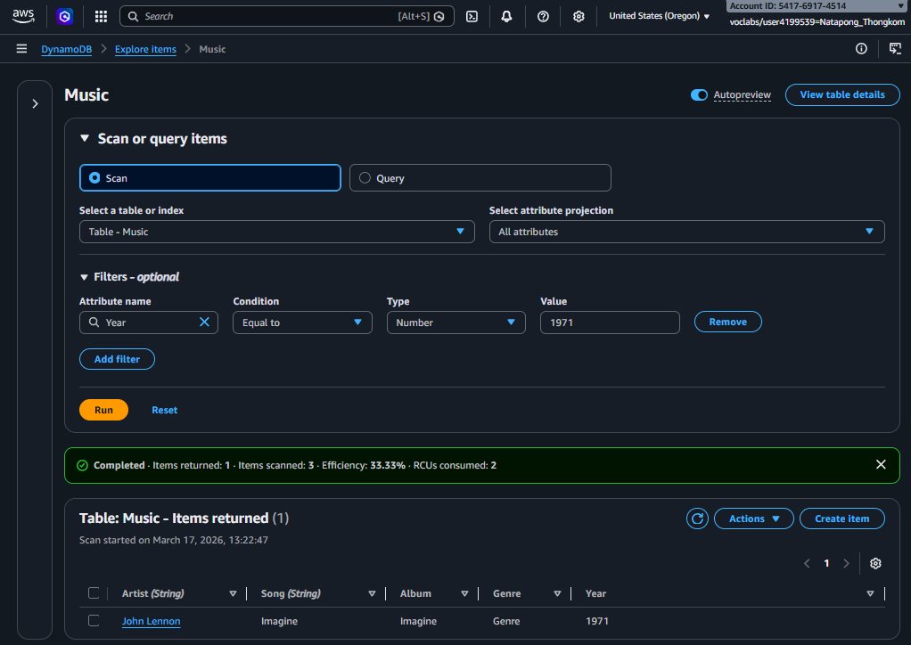

## **Task 1: Create a new table**

`Create a new table named Music in DynamoDB. Each table requires a partition key (or a primary key) that is used to partition data across DynamoDB servers. A table can also have a sort key. The combination of a partition key and sort key uniquely identifies each item in a DynamoDB table.`

## **Task 2: Add data**
`Add data to the Music table.`

## **Task 3: Modify an existing item**
 ` Modify an existing item.`
 >Before
 >

 >After
 >

## **Task 4: Query the table**
 >Query
 

 >Scan
 