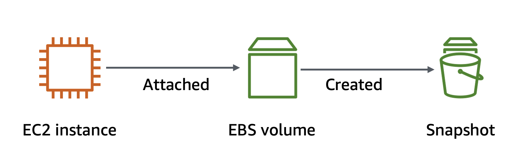

# Working with Amazon EBS

#### Lab overview
Amazon Elastic Block Store (Amazon EBS) is a scalable, high-performance block-storage service that is designed for Amazon Elastic Compute Cloud (Amazon EC2). In this lab, you learn how to create an EBS volume and perform operations on it, such as attaching it to an instance, creating a file system, and taking a snapshot backup.  

#### Objectives
By the end of this lab, you will be able to do the following:
- Create an EBS volume.
- Attach and mount an EBS volume to an EC2 instance.
- Create a snapshot of an EBS volume.
- Create an EBS volume from a snapshot.