## **Task 1: Creating a new EBS volume**  
In This Task, Create and attach an EBS volume to a new EC2 instance.
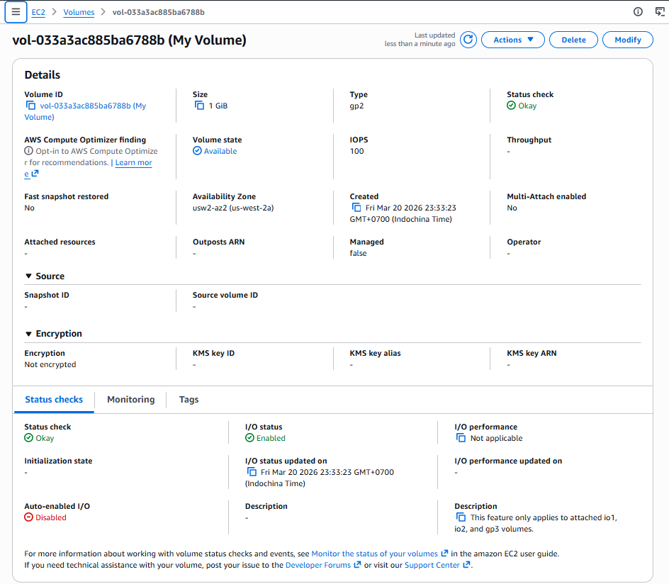

## **Task 2: Attaching the volume to an EC2 instance**  
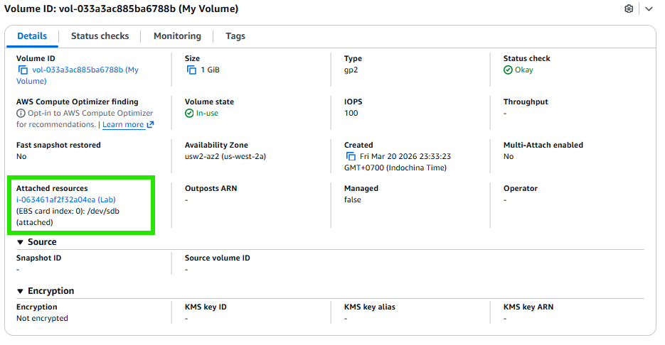
 
## **Task 3: Connecting to the EC2 instance, Creating and configuring the file system**  
In this task, using EC2 Instance Connect to connect to the Lab EC2 instance, add the new volume to a Linux instance as an ext3 file system under the /mnt/data-storexe mount point.

`These results show the original 8 GB disk volume.The new volume is not yet shown.`  
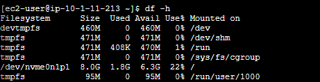

>Create an ext3 file system on the new volume
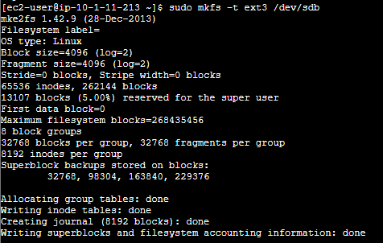

>Create a directory to mount the new storage volume
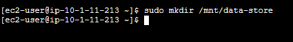  
` In Linux, we don't use Drive C: or D: like in Windows, but we bind the Disk to a "folder".`  
`This command creates a folder named data-store to prepare for accessing data in a new EBS.`

>Mount the new volume
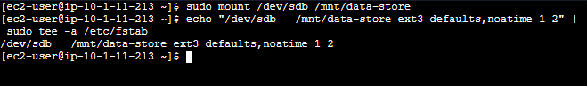
`The last line in this command ensures that the volume is mounted even after the instance is restarted.`

>View the configuration file to see the setting on the last line
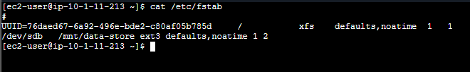

>View the available storage again
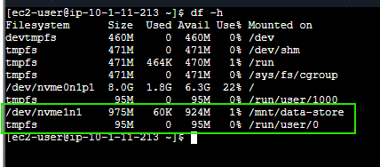  
` You will see a new line appear (/dev/nvme1n1), indicating that the space is now available.`

>Try to create a file and add some text on the mounted volume.
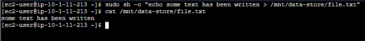

## **Task 4: Creating an Amazon EBS snapshot**
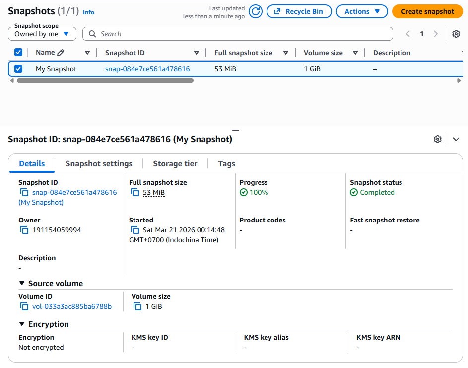

>Delete file created on the volume
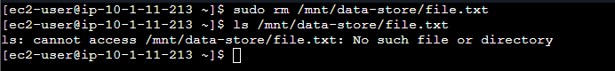

## **Task 5: Restoring the Amazon EBS snapshot**
If it is necessary to retrieve data stored in a snapshot.Snapshots can be restored to a new EBS volume.

>Creating a volume by using the snapshot
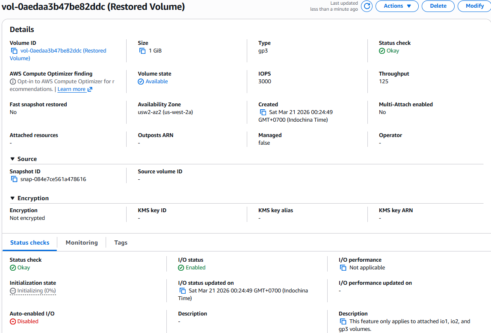

>Attaching the restored volume to the EC2 instance
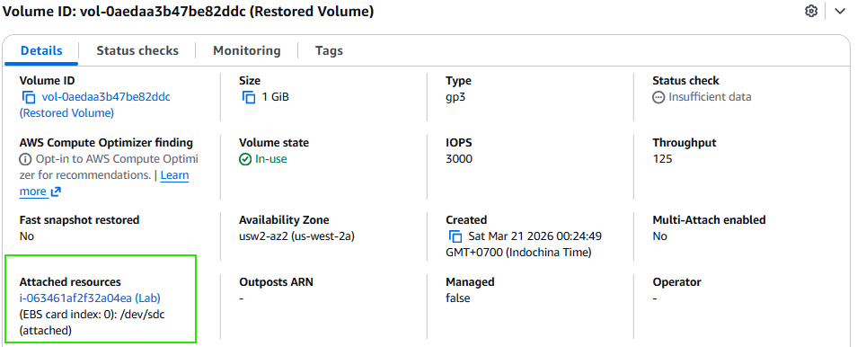

>Mounting the restored volume
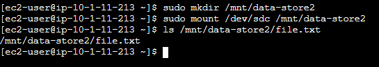

### Finished  !! 🎉