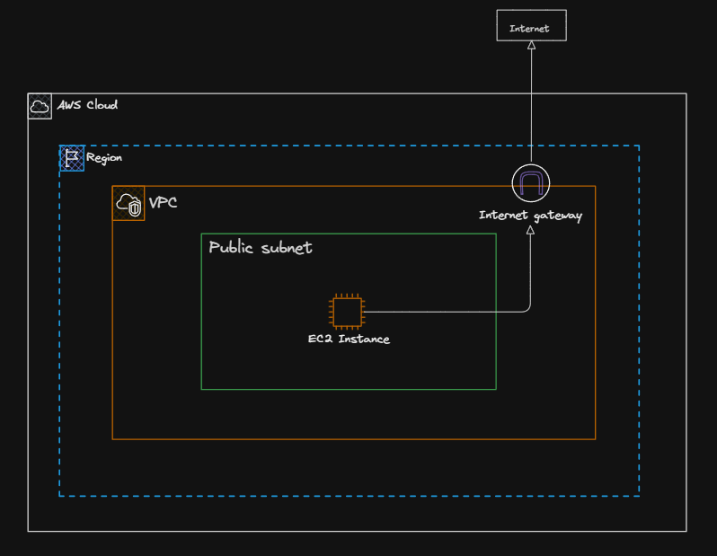
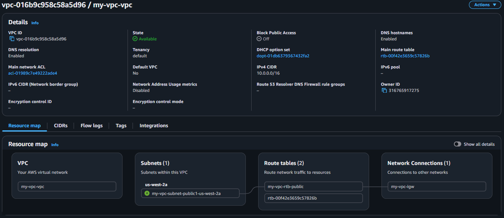
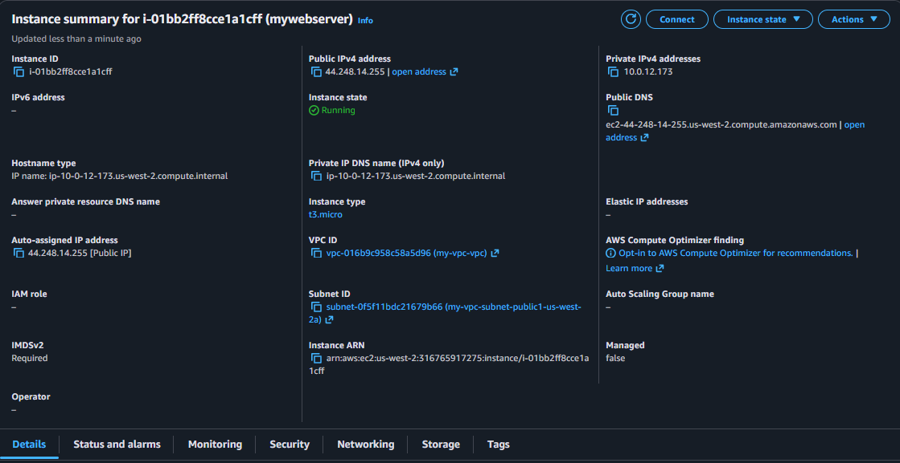
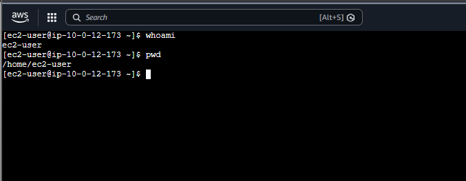
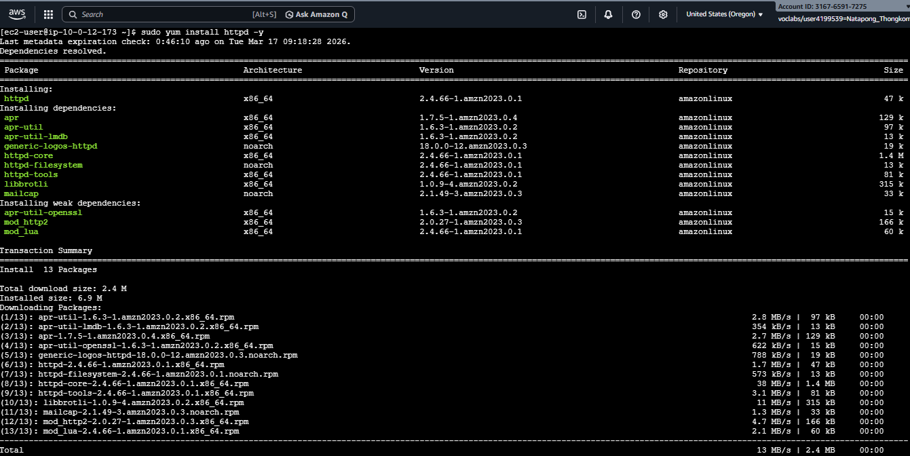
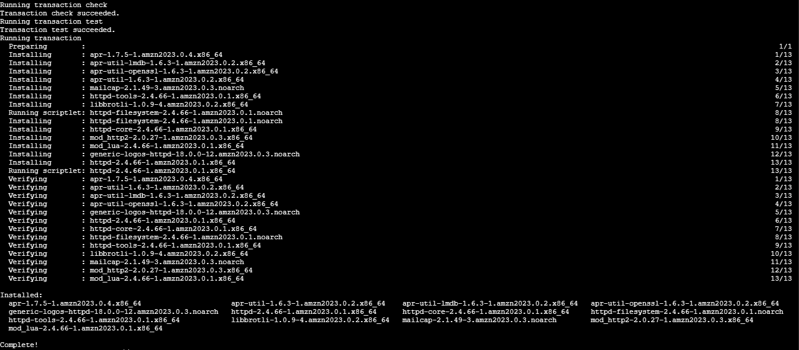
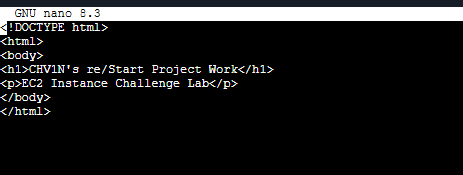
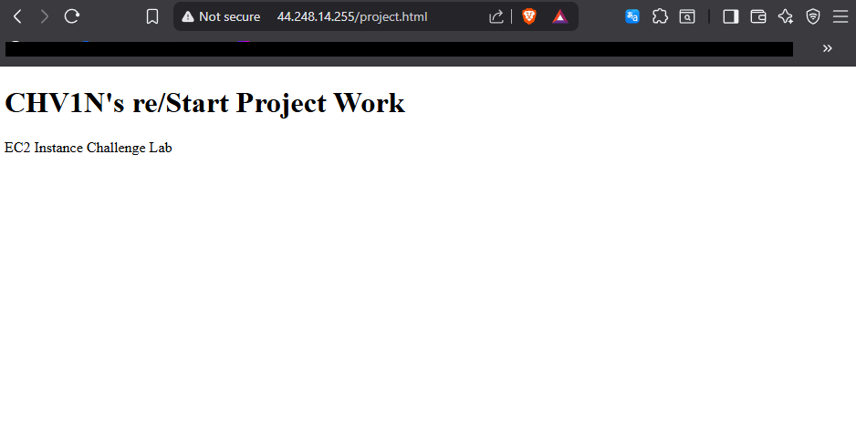

## **Task 1: Create VPC**
`Create an internet gateway and properly configure the subnet's route table in your VPC before launch instance.`

## **Task 2: Launch and Connect EC2 Instance **
`Use EC2 Instance Connect to connect over SSH to your EC2 instance by using a web browser.`

## **Task 3: Install httpd **

## **Task 4: Create html file **
`Create html file and place this file in the /var/www/html directory of your EC2 instance.`

## **Task 4: Open a web browser**
`Open a web browser, and navigate to this sample webpage.`

### Finished  !! 🎉