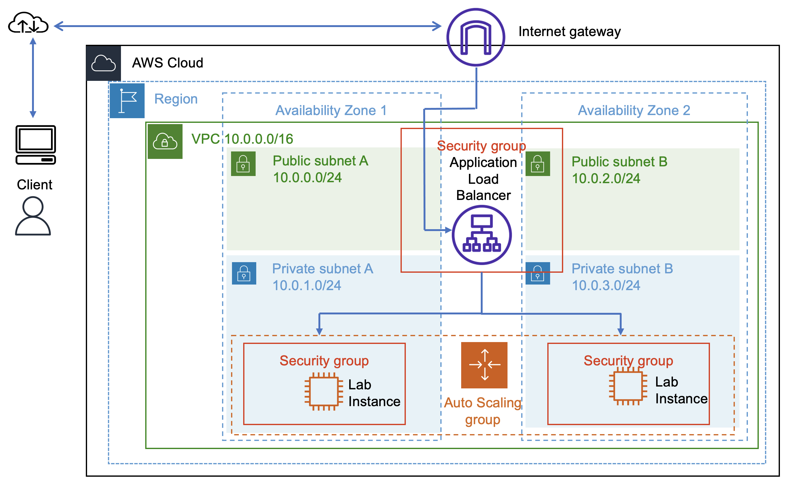

# Scaling and Load Balancing Your Architecture
#### Lab overview
In this lab, you use the Elastic Load Balancing (ELB) and Amazon EC2 Auto Scaling to load balance and automatically scale your infrastructure.

ELB automatically distributes incoming application traffic across multiple Amazon Elastic Compute Cloud (Amazon EC2) instances. ELB provides the amount of load balancing capacity needed to route application traffic to help you achieve fault tolerance in your applications.

Auto Scaling helps you maintain application availability and gives you the ability to scale your Amazon EC2 capacity out or in automatically according to conditions that you define. You can use auto scaling to help ensure that you are running your desired number of EC2 instances. Auto scaling can also automatically increase the number of EC2 instances during spikes in demand to maintain performance and can decrease capacity during lulls to reduce costs. Auto scaling is well suited to applications that have stable demand patterns or that experience hourly, daily, or weekly variability in usage.  

The following is the starting architecture:

The following is the final architecture:

#### Objectives
After completing this lab, you should be able to do the following:

- Create an AMI from an EC2 instance.
- Create a load balancer.
- Create a launch template and an Auto Scaling group.
- Configure an Auto Scaling group to scale new instances within private subnets.
- Use Amazon CloudWatch alarms to monitor the performance of your infrastructure.

