## **Task 1: Creating an AMI for auto scaling**
`Create an AMI from the existing Web Server 1.`
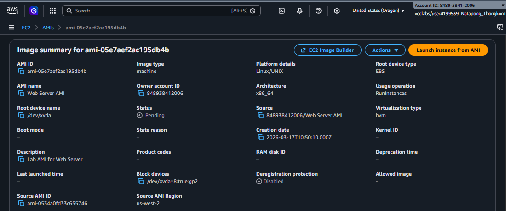

## **Task 2: Create a target group**
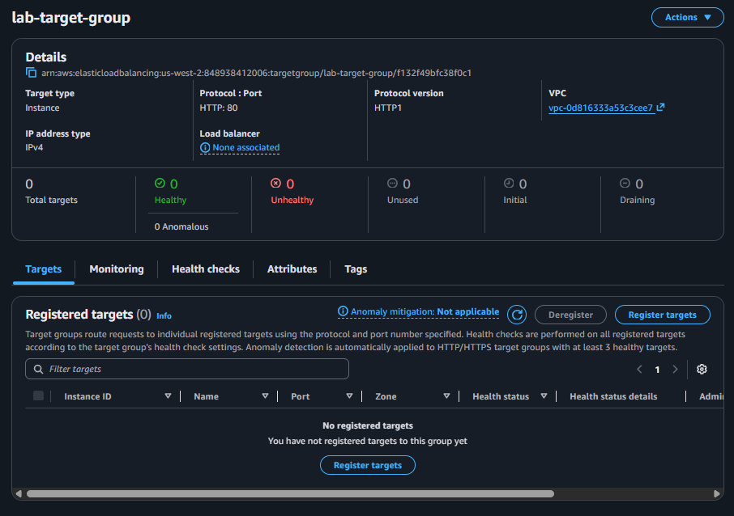

## **Task 3: Create a Load Balance**
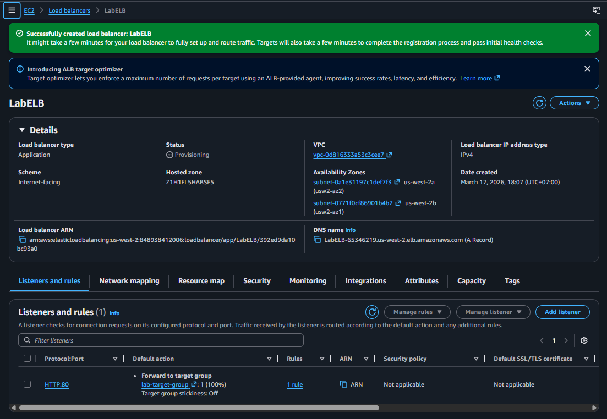

## **Task 4: Creating a launch template**
`Create a launch template for Auto Scaling group. A launch template is a template that an Auto Scaling group uses to launch EC2 instances.`
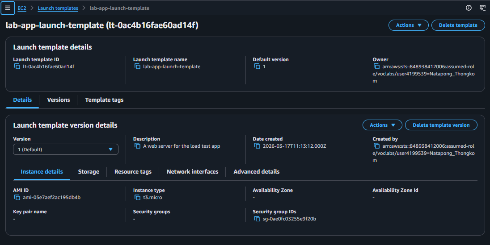

## **Task 5: Creating an Auto Scaling group**
`Use a launch template to create an Auto Scaling group, which is configured to maintain an average CPU utilization of 50%.It automatically adds or removes EC2 instances as needed to keep the system's performance balanced and cost-effective`
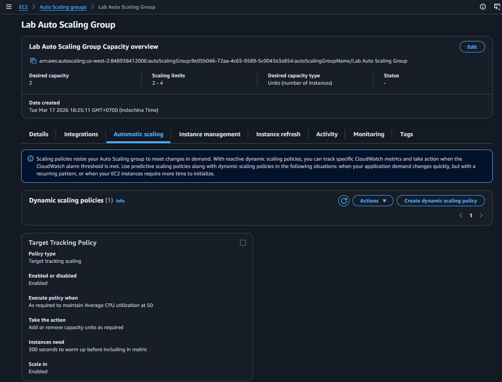

## **Task 6: Verifying that load balancing is working**
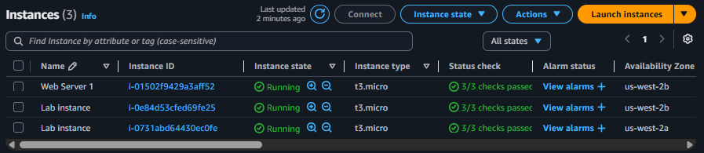

`Registered Target`
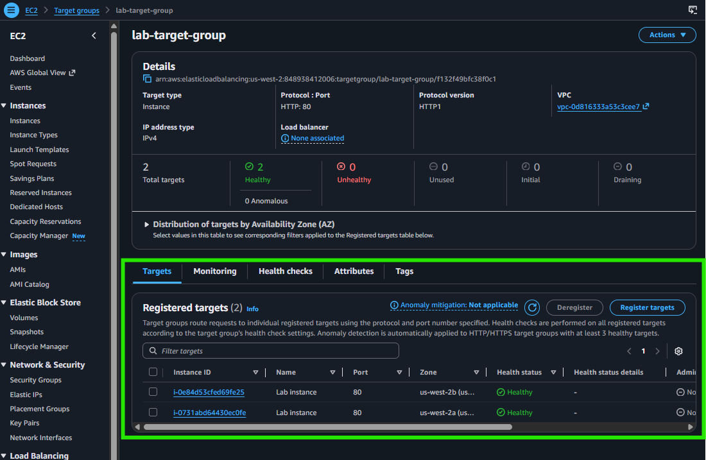

`Load Test`
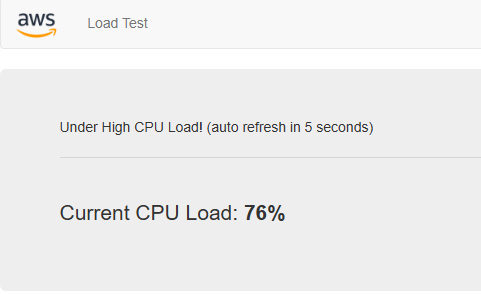

`Monitoring Dashboard`
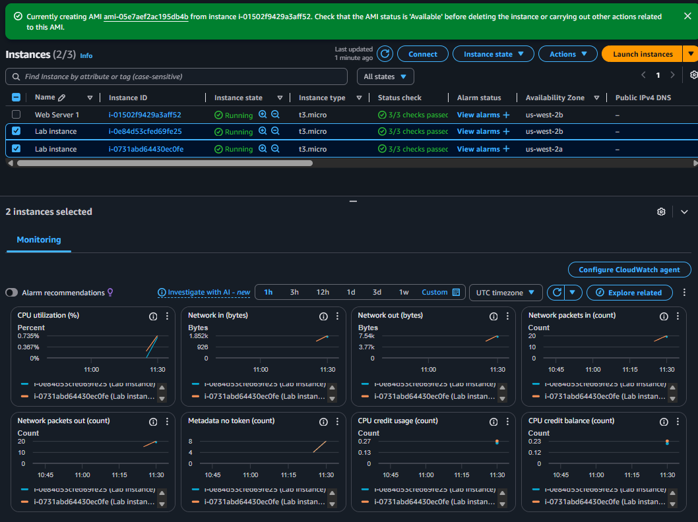

## **Task 7: Testing auto scaling**
`Target Tracking Alarm in the 'In alarm' state, indicating that average CPU utilization has exceeded the 50% threshold and is currently triggering the Auto Scaling Group to add more instances`
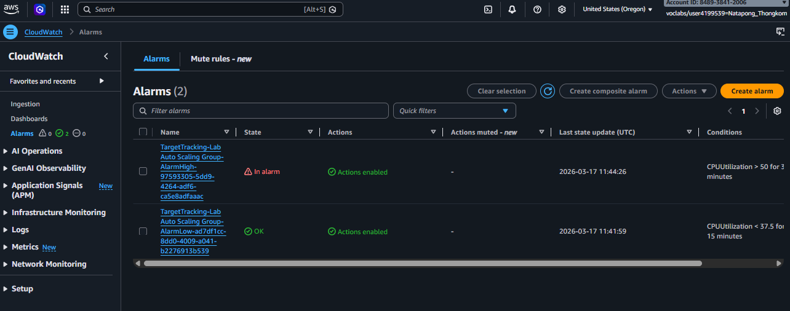

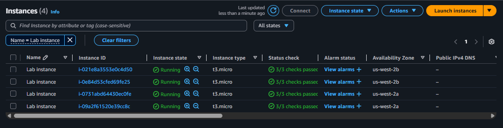

### Finished  !! 🎉