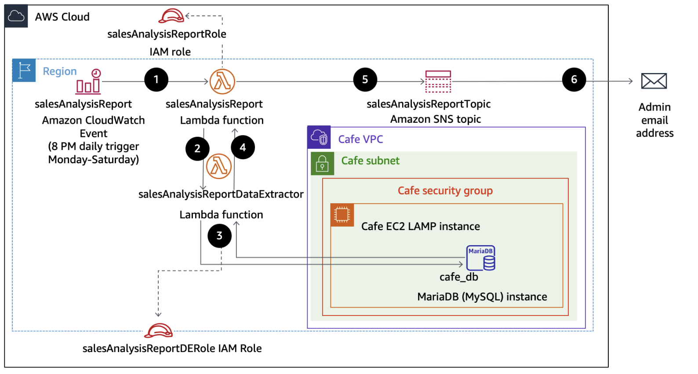

# Working with AWS Lambda
#### Lab overview
In this lab, you deploy and configure an AWS Lambda based serverless computing solution. The Lambda function generates a sales analysis report by pulling data from a database and emailing the results daily. The database connection information is stored in Parameter Store, a capability of AWS Systems Manager. The database itself runs on an Amazon Elastic Compute Cloud (Amazon EC2) Linux, Apache, MySQL, and PHP (LAMP) instance.

The following diagram shows the architecture of the sales analysis report solution and illustrates the order in which actions occur.

The diagram includes the following function steps:
| Step | Details |
|------|---------|
| 1 | An Amazon CloudWatch Events event calls the salesAnalysisReport Lambda function at 8 PM every day Monday through Saturday. |
| 2 | The salesAnalysisReport Lambda function invokes another Lambda function, salesAnalysisReportDataExtractor, to retrieve the report data. |
| 3 | The salesAnalysisReportDataExtractor function runs an analytical query against the café database (cafe_db). |
| 4 | The query result is returned to the salesAnalysisReport function. |
| 5 | The salesAnalysisReport function formats the report into a message and publishes it to the salesAnalysisReportTopic Amazon Simple Notification Service (Amazon SNS) topic. |
| 6 | The salesAnalysisReportTopic SNS topic sends the message by email to the administrator. |

The diagram includes the following function steps:

#### Objectives
After completing this lab, you will be able to do the following:
- Recognize necessary AWS Identity and Access Management (IAM) policy permissions to facilitate a Lambda function to other Amazon Web Services (AWS) resources.
- Create a Lambda layer to satisfy an external library dependency.
- Create Lambda functions that extract data from database, and send reports to user.
- Deploy and test a Lambda function that is initiated based on a schedule and that invokes another function.
- Use CloudWatch logs to troubleshoot any issues running a Lambda function.

