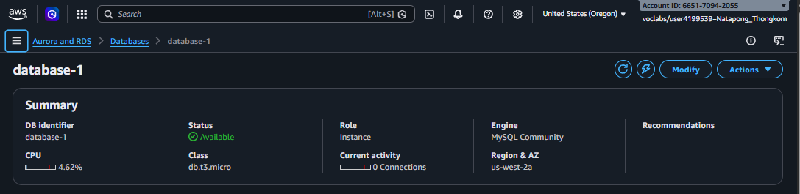
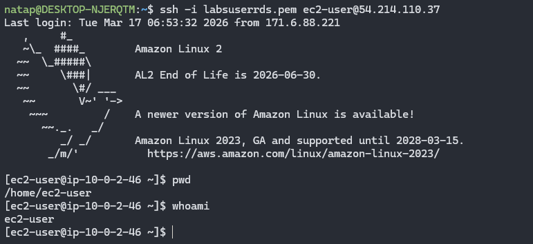
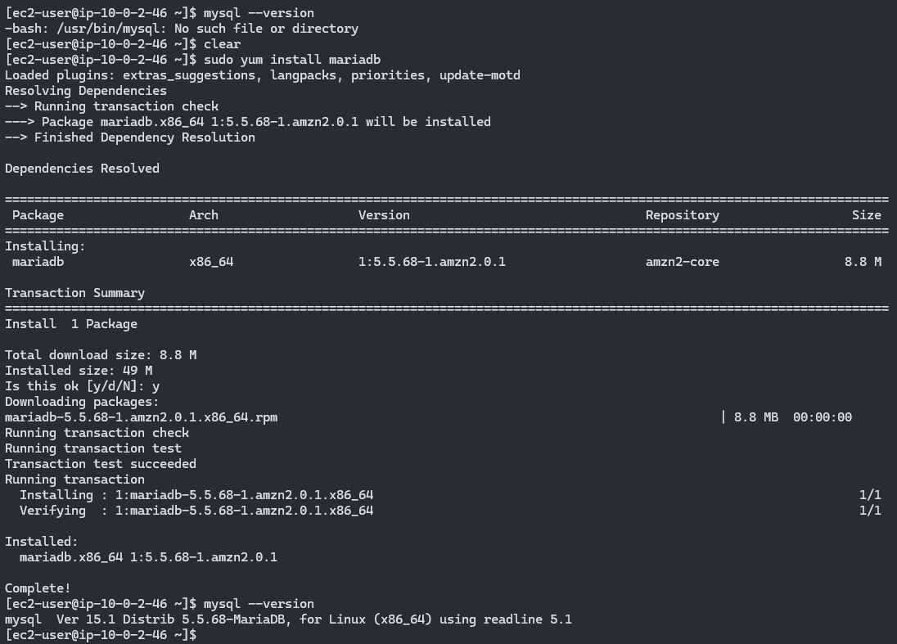
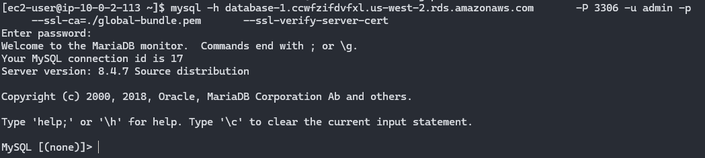
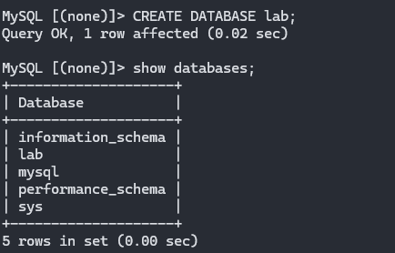
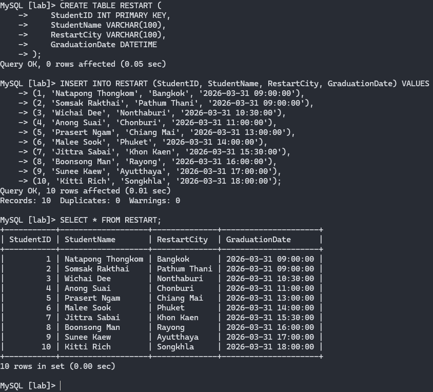

## **Task 1: Launch an Amazon RDS DB instance**
`Launch an Amazon RDS DB instance using either Amazon Aurora Provisioned DB or MySQL database engines.`

## **Task 2: Connect (SSH) to the LinuxServer**

## **Task 3: Install a MySQL client**

## **Task 4: Connect to db**

## **Task 5: Create and Show Database**

## **Task 5: Create Table, Insert and Select Data**

### Finished  !! 🎉