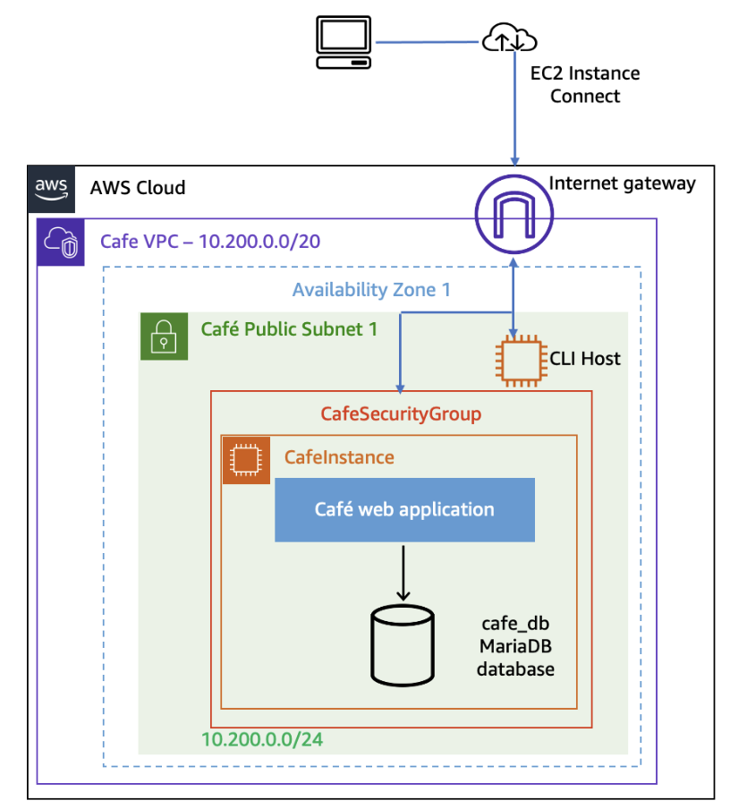
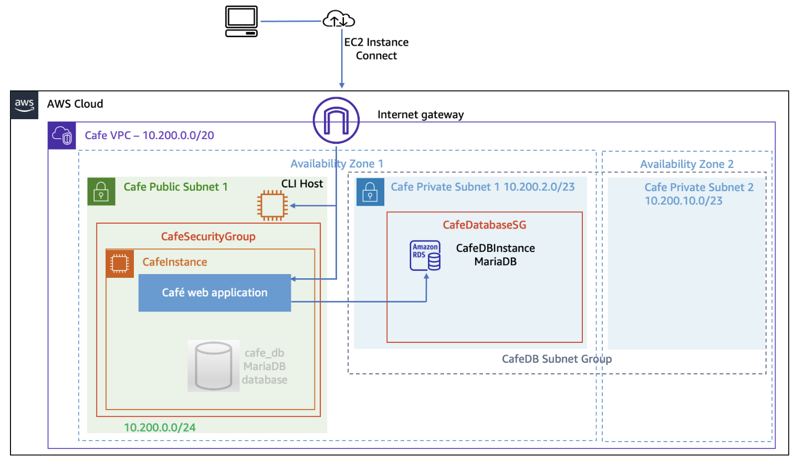

# Migrating to Amazon RDS

#### Lab overview
In this lab, you migrate the café web application to use a fully managed Amazon Relational Database Service (Amazon RDS) database (DB) instance instead of a local database instance.

You begin by generating some data on the existing database. This data is migrated to the new Amazon RDS instance.

During the migration process, you build the required components, including two private subnets in different Availability Zones, a security group for the database instance, and the RDS DB instance itself. After the database has been migrated, you reconfigure the café application to use the Amazon RDS instance instead of a local database.

**Starting architecture**  
The following diagram illustrates the topology of the café web application runtime environment before the migration. The application database runs in an Amazon Elastic Compute Cloud (Amazon EC2) Linux, Apache, MySQL, and PHP (LAMP) instance along with the application code. The instance has a T3 small instance type and runs in a public subnet so that internet clients can access the website. A CLI Host instance resides in the same subnet to facilitate the administration of the instance by using the AWS Command Line Interface (AWS CLI).

**Final architecture**  
The following diagram illustrates the topology of the café web application runtime environment after the migration.  
You migrate the local café database to an Amazon RDS database that resides outside the instance. The Amazon RDS database is deployed in the same virtual private cloud (VPC) as the instance.

#### Objectives
After completing this lab, you will be able to do the following:
- Create an Amazon RDS MariaDB instance by using the AWS CLI.
- Migrate data from a MariaDB database on an EC2 instance to an Amazon RDS MariaDB instance.
- Monitor the Amazon RDS instance by using Amazon CloudWatch metrics.

