## **Task 1: Generating order data on the café website**
`Browse the café website and place a few orders that are stored in the existing database. Placing orders creates data for the application before the application is migrated to new Amazon RDS instance.`
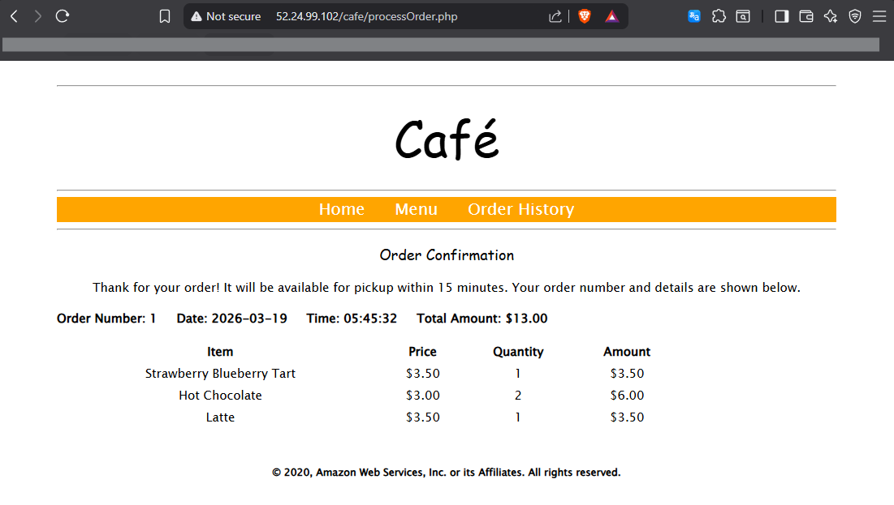

## **Task 2: Creating an Amazon RDS instance by using the AWS CLI**
Create the following components that are shown in the final architecture diagram:
- CafeDatabaseSG (Security group for the Amazon RDS database)
- CafeDB Private Subnet 1
- CafeDB Private Subnet 2
- CafeDB Subnet Group (Database subnet group)

>Connecting to the CLI Host instance and Configuring the AWS CLI  
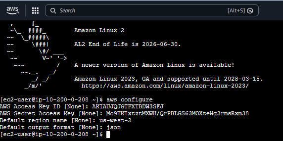

>Creating prerequisite components  
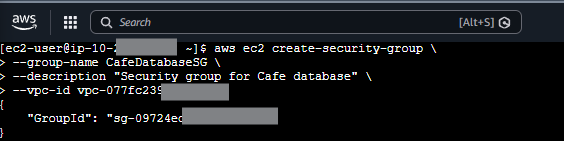
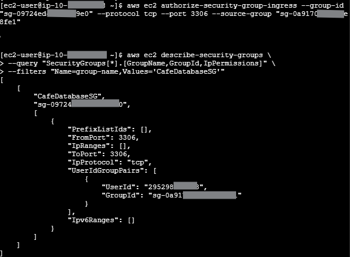  
**Create Subnet**  
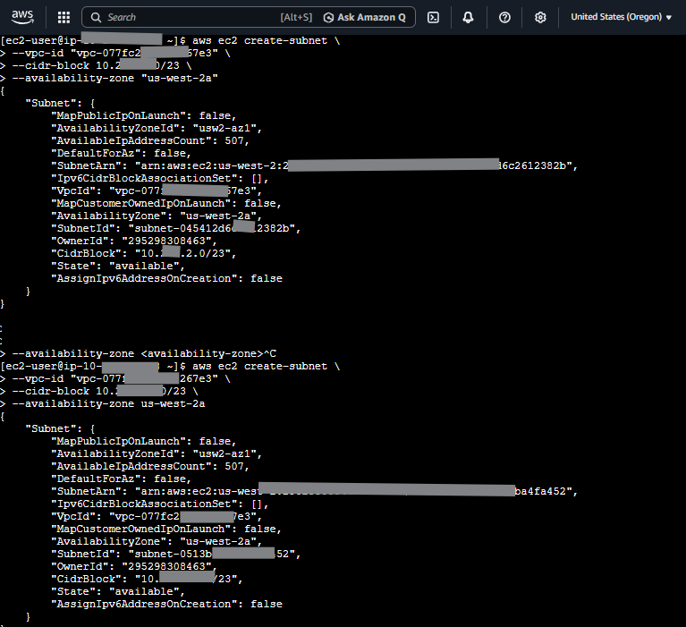  
**Create subnet Group**  
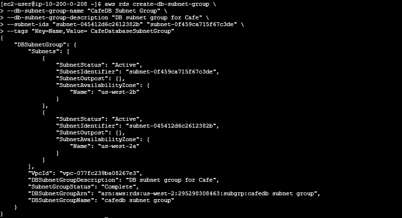

>Creating the Amazon RDS MariaDB instance  
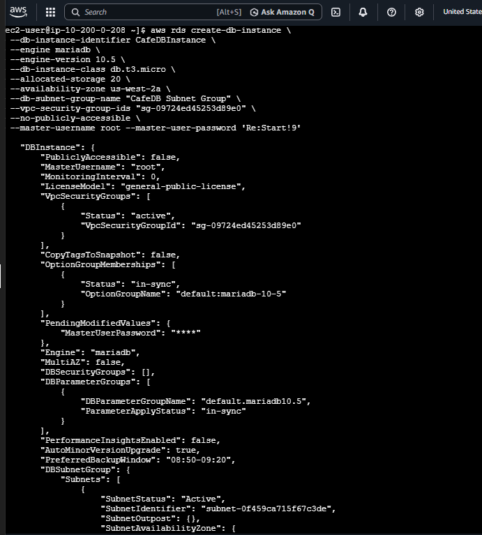

## **Task 3: Migrating application data to the Amazon RDS instance**  
In this task, Migrate the data from the existing local database to the newly created Amazon RDS database  
- Connect to the CafeInstance by using EC2 Instance Connect.
- Use the mysqldump utility to create a backup of the local database.
- Restore the backup to the Amazon RDS database.
- Test the data migration.  

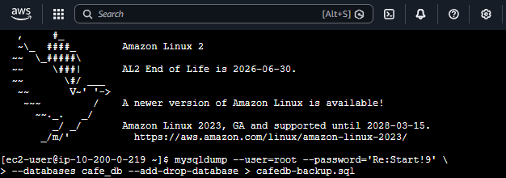
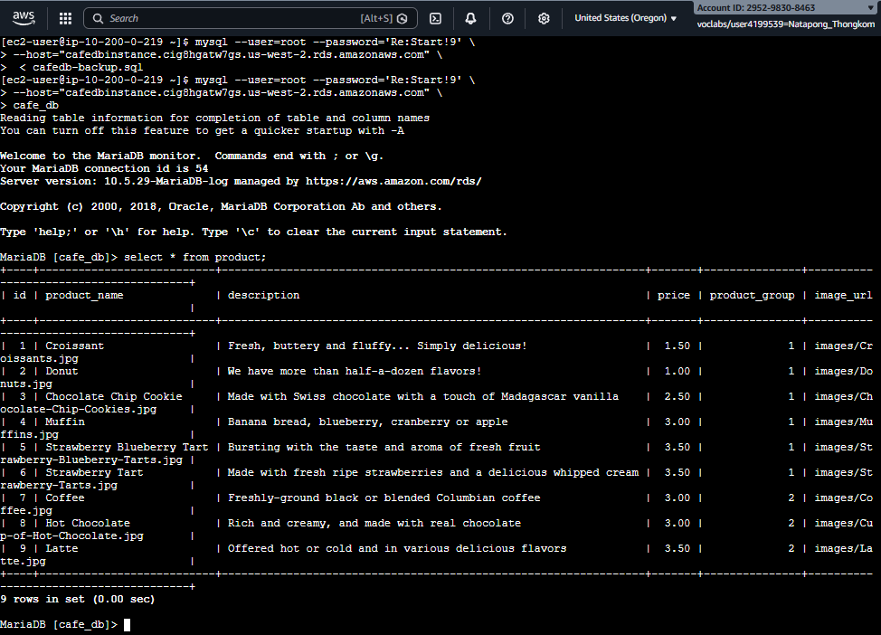

## **Task 4: Configuring the website to use the Amazon RDS instance**  
In this task, change the database URL parameter of the café application to point to the endpoint address of the RDS instance.  

>Before
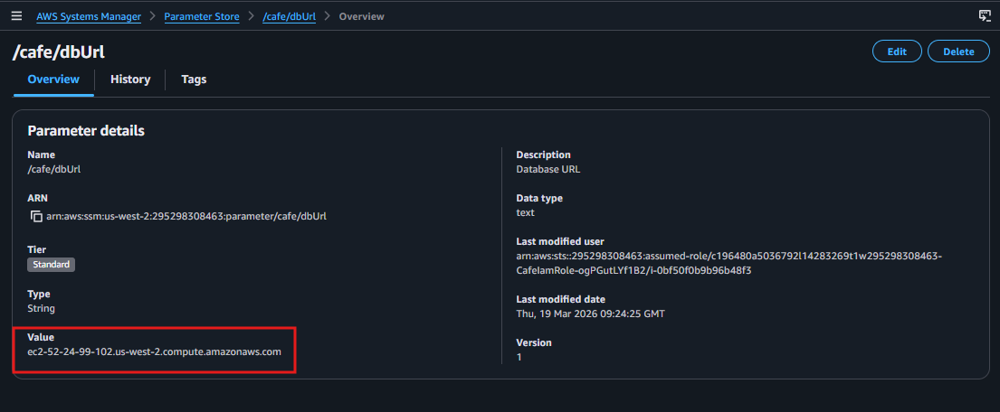

>After  
`The dbUrl parameter now references the RDS DB instance instead of the local database.`
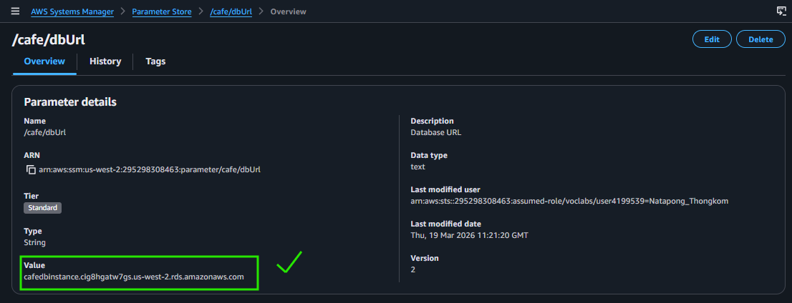

>Test the website to confirm that it is able to access the new database correctly  
In Order History tab. and observe the number of orders in the database. Compare this number with the number of orders that you recorded before the database migration. Both numbers should be the same as **Task 1**
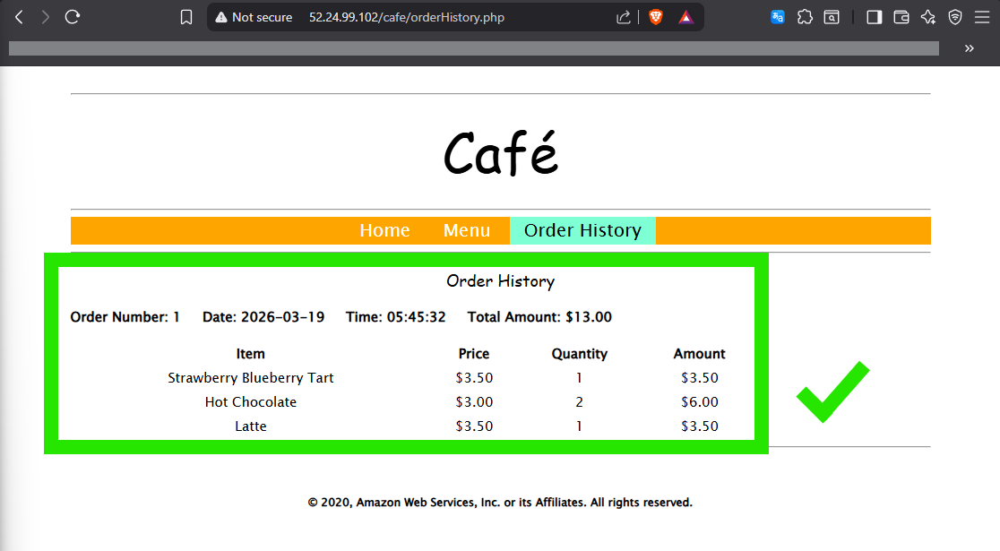

## **Task 5: Monitoring the Amazon RDS database**  
One of the benefits of using Amazon RDS is the ability to monitor the performance of a database instance. Amazon RDS automatically sends metrics to CloudWatch every minute for each active database. In this task, identify some of these performance metrics and learn how to monitor a metric in the Amazon RDS console.
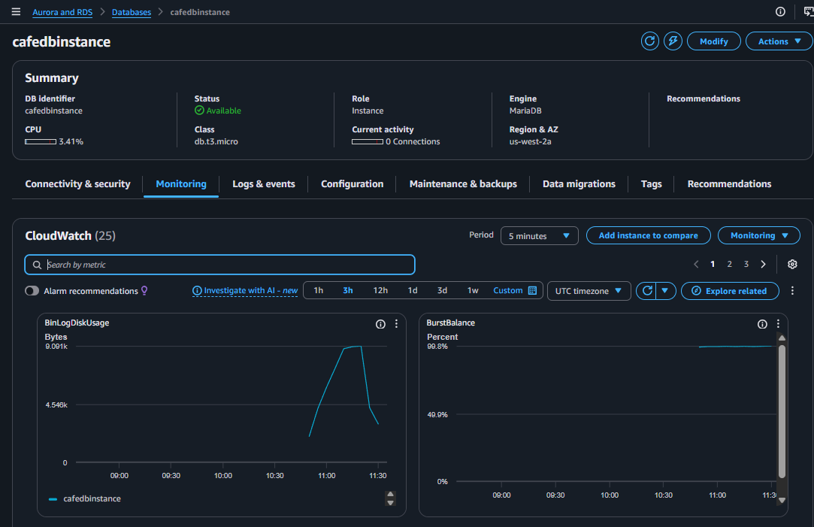

### Finished  !! 🎉
