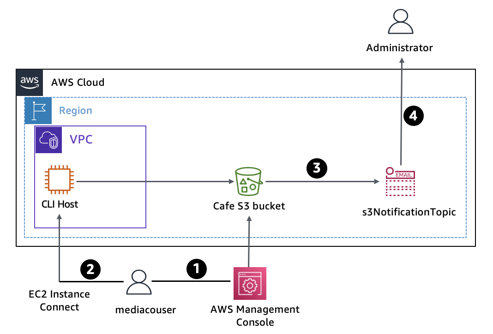

# Configuring a VPC

#### Lab overview
In this lab, you create and configure an Amazon Simple Storage Service (Amazon S3) bucket to share images with an external user at a media company (mediacouser) who has been hired to provide pictures of the products that the café sells. You also configure the S3 bucket to automatically send an email notification to the administrator when the bucket contents are modified.

The following diagram shows the component architecture of the Amazon S3 file-sharing solution and illustrates its usage flow.

An AWS Identity and Access Management (IAM) user named mediacouser, which represents an external user at a media company, has been pre-created with the appropriate Amazon S3 permissions to allow the user to add, change, or delete images from the bucket. The necessary Amazon S3 permissions are reviewed for each user to make sure that access to the bucket is secure and appropriate for each role.  

The following steps describe the usage flow in the diagram:

When new product pictures are available or when existing pictures must be updated, a representative from the media company signs in to the AWS Management Console as mediacouser to upload, change, or delete the bucket contents.

As an alternative, mediacouser can use the AWS Command Line Interface (AWS CLI) to change the contents of the S3 bucket.

When Amazon S3 detects a change in the contents of the bucket, it publishes an email notification to the s3NotificationTopic Amazon Simple Notification Service (Amazon SNS) topic.

The administrator who is subscribed to the s3NotificationTopic SNS topic receives an email message that contains the details of the changes to the contents of the bucket.   

#### Objectives
By the end of this lab, you will be able to do the following:
- Use the s3api and s3 AWS CLI commands to create and configure an S3 bucket.
- Verify write permissions to a user on an S3 bucket.
- Configure event notification on an S3 bucket.