## **Task 1: Connecting to the CLI Host EC2 instance and configuring the AWS CLI**  
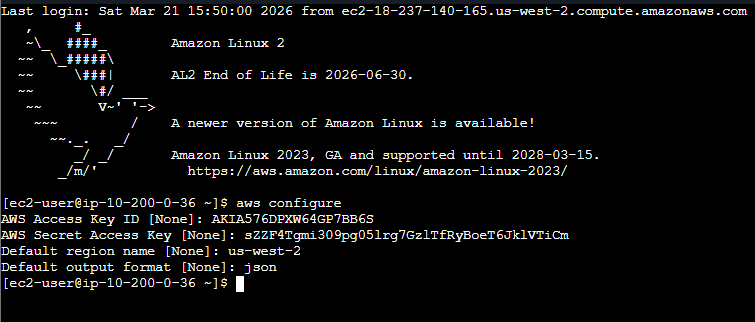

## **Task 2: Creating and initializing the S3 share bucket**  
In this task, using the AWS CLI to create the S3 share bucket and upload a few images. 

>Create bucket  
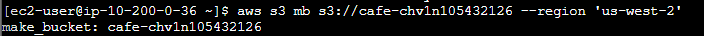

>Load image into the bucket
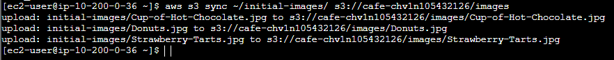

>Verify that the files ware synced to the S3 Bucket
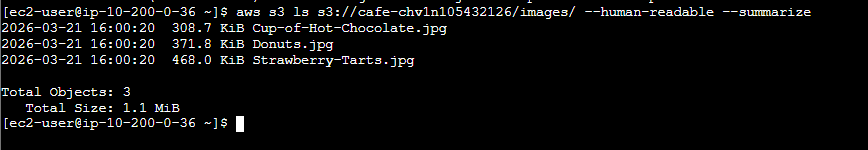

## **Task 3: Reviewing the IAM group and user permissions** 

>Reviewing the mediaco IAM group
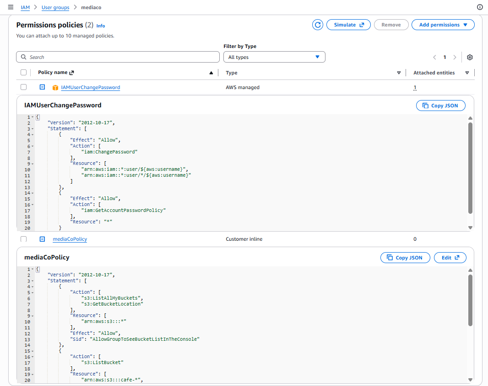

>Reviewing the mediacouser IAM user 
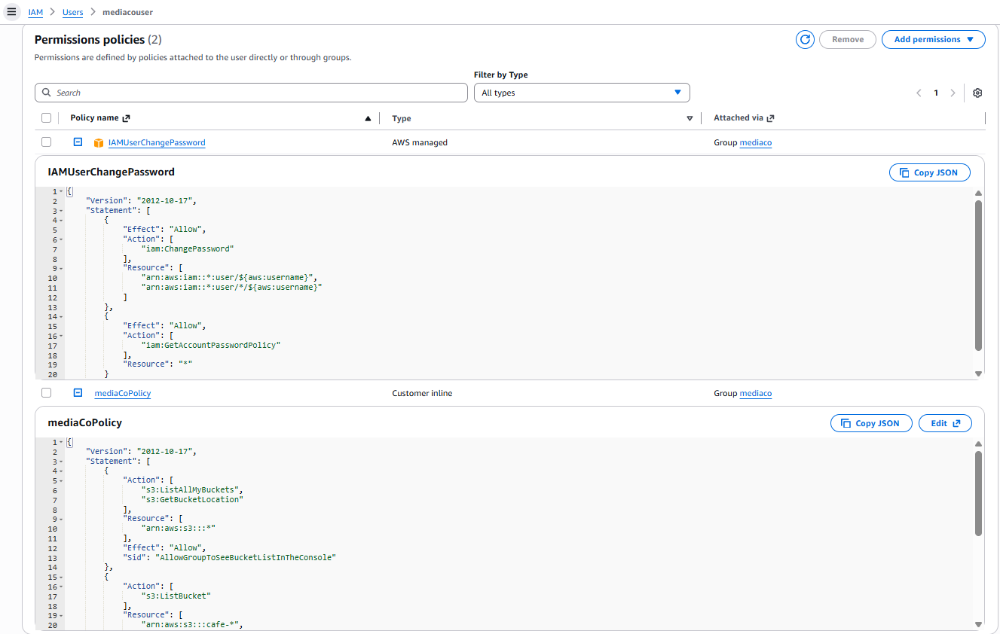

>Create Access Key
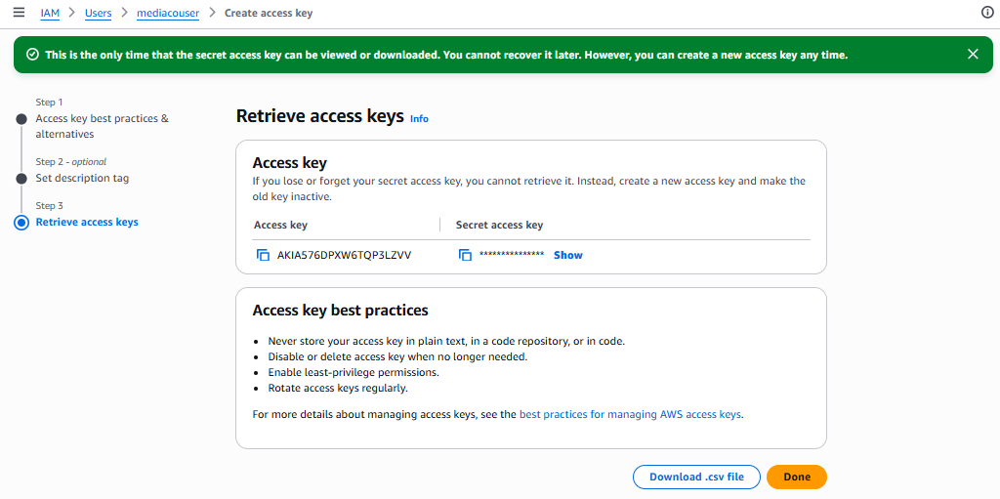

## **Task 4: Configuring event notifications on the S3 share bucket**
In this task, configure the S3 share bucket to generate an event notification to an SNS topic whenever the contents of the bucket change. The SNS topic then sends an email message to its subscribed users with the notification message.  
Perform the following steps:
- Create the s3NotificationTopic SNS topic.
- Grant Amazon S3 permission to publish to the topic.
- Subscribe to the topic.
- Add an event notification configuration to the S3 bucket.

>Creating and configuring the s3NotificationTopic SNS topic  
Edit Access policy
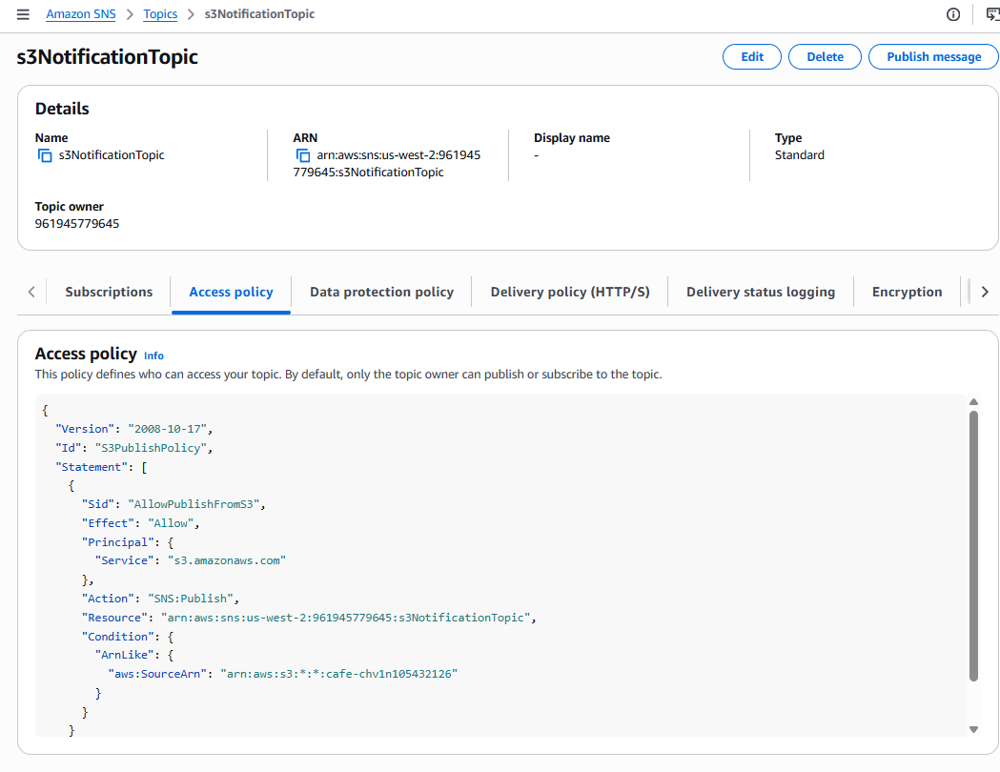

Subscribe to the topic to recive the event notification.
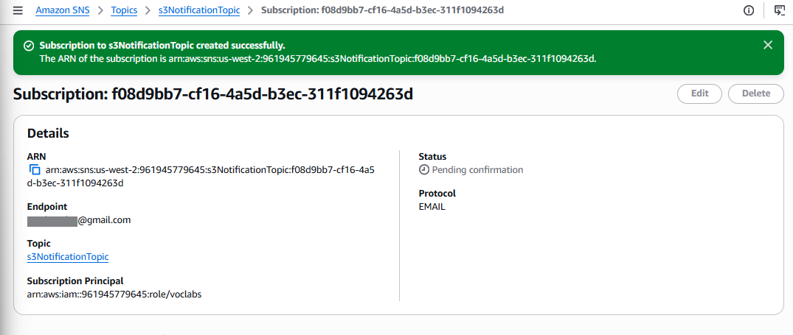

Confirm subscription
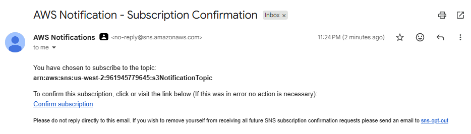
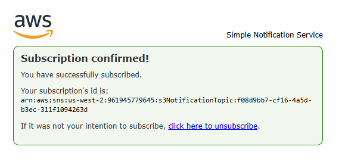

>Adding an event notification configuration to the S3 bucket
In this task, create an event notification configuration file that identifies the events that Amazon S3 will publish and the topic destination where Amazon S3 will send the event notifications. And then use the s3api CLI commands to associate this configuration file with the S3 share bucket.
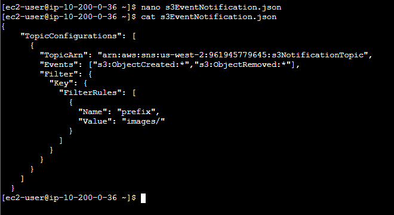

Associate the event configuration file with the S3 share bucket.   
`This command is " Setting S3 Bucket to save audit logs (Event Notification) Navigate" direction of travel to the next Bucket.`  
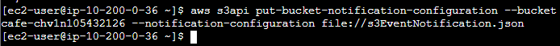

`After that I received a notification email.`  
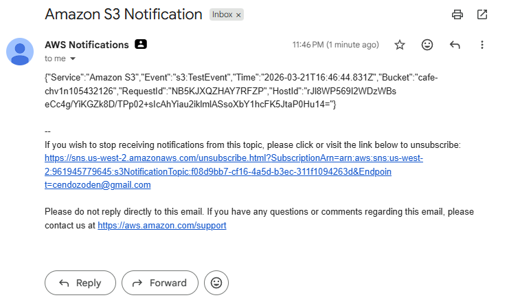

## **Task 5: Testing the S3 share bucket event notifications**  
 In this task,  test the configuration of the S3 share bucket event notification by performing the use cases that mediacouser expects to perform on the bucket. These actions include putting objects into and deleting objects from the bucket, which send email notifications. Also test an unauthorized operation to verify that it is rejected. Use the AWS s3api CLI command to perform these operations on the S3 share bucket.

>Configure the CLI Host's AWS CLI client software to use the mediacouser credentials
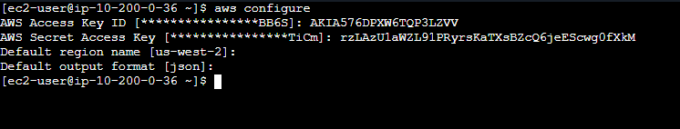
(Access key ID of mediacouser, Secret Access Key of mediacouser)

>Upload and delete this file  
` I tried uploading a file and then deleting the file. After that I got a notification.  `
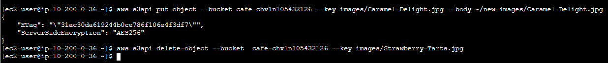
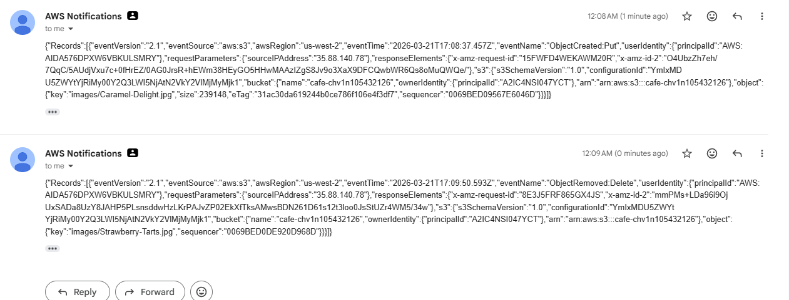

### Finished  !! 🎉