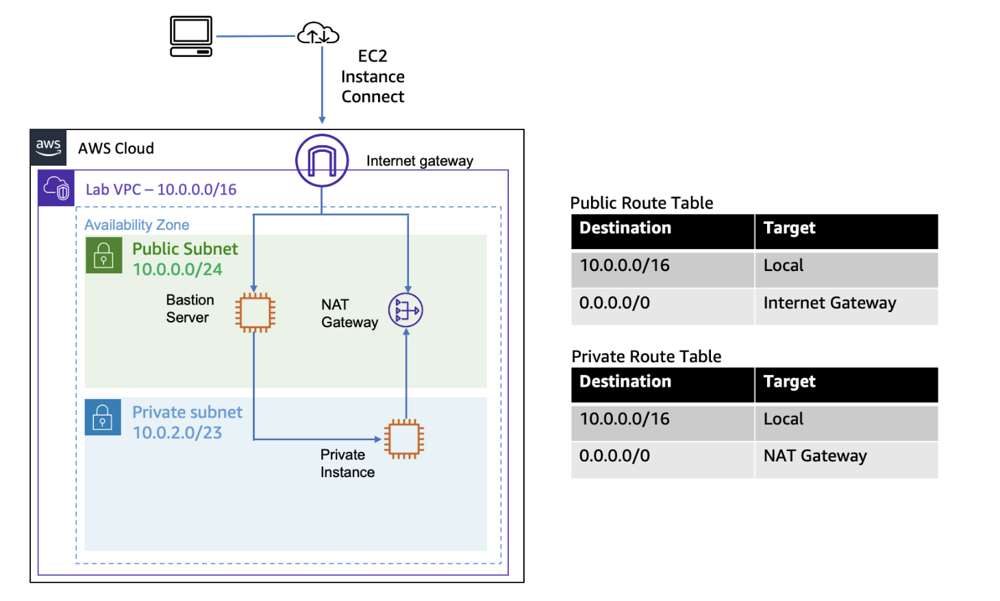

# Configuring a VPC

#### Lab overview
Amazon Virtual Private Cloud (Amazon VPC) gives you the ability to provision a logically isolated section of the Amazon Web Services (AWS) Cloud where you can launch AWS resources in a virtual network that you define. You have complete control over your virtual networking environment, including selecting your IP address ranges, creating subnets, and configuring route tables and network gateways.

In this lab, you build a virtual private cloud (VPC) and other network components required to deploy resources, such as an Amazon Elastic Compute Cloud (Amazon EC2) instance.

#### Objectives
By the end of this lab, you should be able to do the following:
- Create a VPC with a private and public subnet, an internet gateway, and a NAT gateway.
- Configure route tables associated with subnets to local and internet-bound traffic by using an internet gateway and a NAT gateway.
- Launch a bastion server in a public subnet.
- Use a bastion server to log in to an instance in a private subnet.