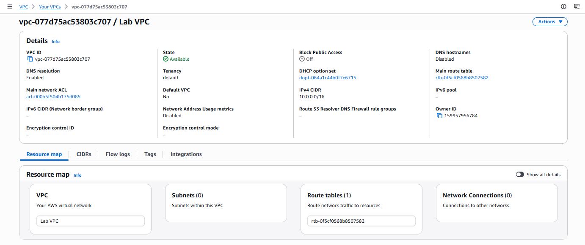
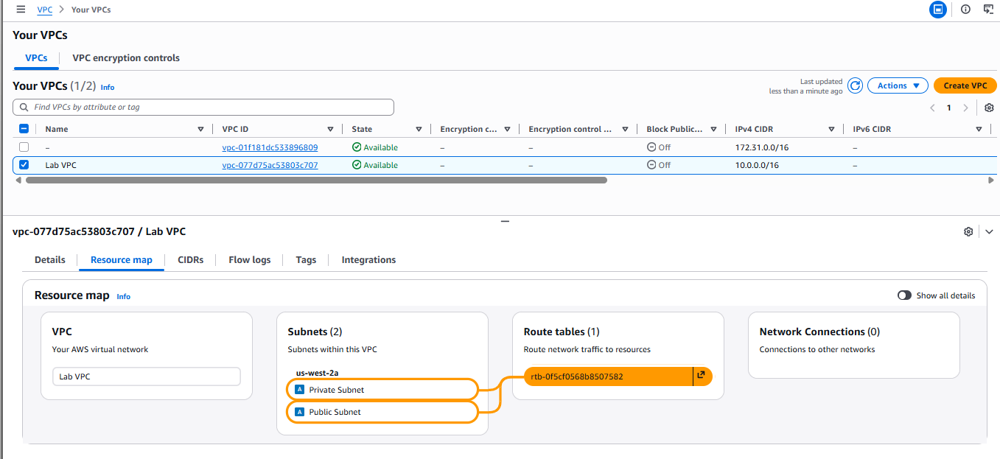
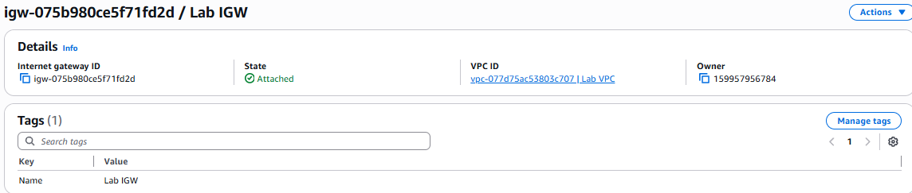
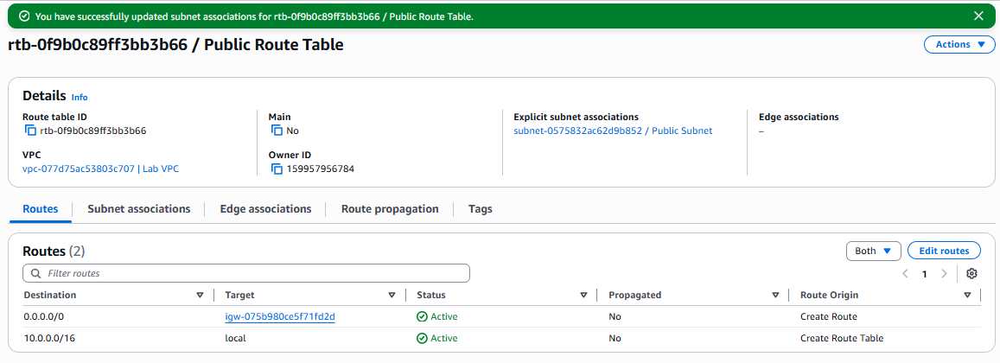
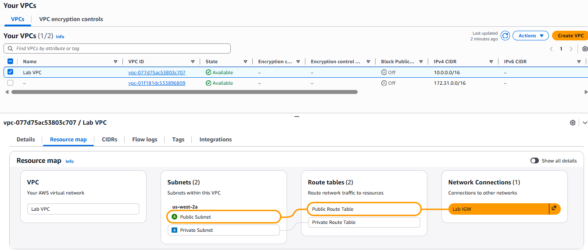
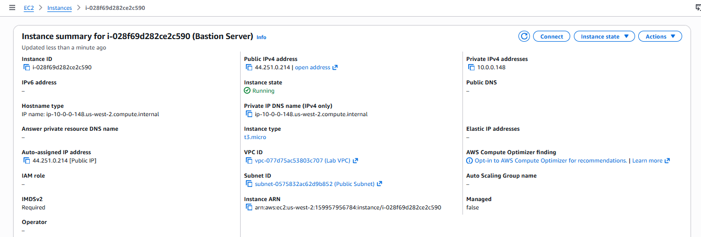
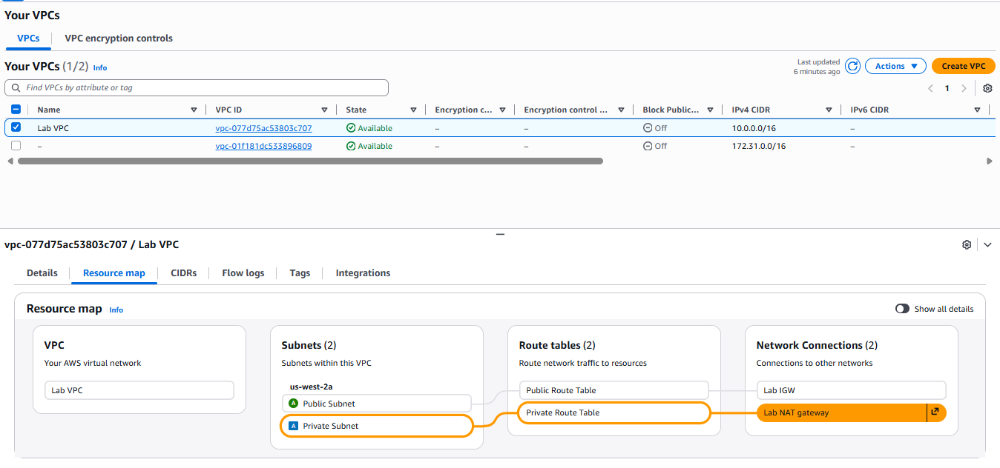

## **Task 1: Creating a VPC**  

## **Task 2: Creating subnets**  

## **Task 3: Creating an internet gateway and Attach to VPC**  

## **Task 4: Configuring route tables**  

## **Task 5: Launching a bastion server in the public subnet**  
Launch an EC2 instance bastion server in the public subnet that you created earlier.  

## **Task 6: Creating a NAT gateway**
Launch a NAT gateway in the public subnet and configure the private route tableto facilitate communication between resources in the private subnet and theinternet. 

 
### Finished  !! 🎉